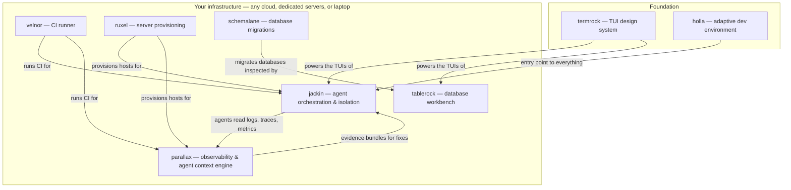

# Tailrocks Vision

> Why Tailrocks exists, what we build, and how the pieces fit together.

Tailrocks is an open-source company building the infrastructure layer for the
post-AI software world: tools that let humans and AI coding agents build, run,
observe, and operate software together — on any cloud, any dedicated server, or
any laptop, always under your control.

Everything we ship is open source (Apache-2.0) from day one. Everything we ship
is dogfooded first by [ChainArgos](https://github.com/ChainArgos), our anchor
customer, before it is offered to anyone else.

---

## The bet

**AI changed who can build software. Open source changes who owns it.**

Before AI, building software was the hard part: it required many engineers, and
few companies could afford them. Strong models removed that barrier. A smaller
team of fast-learning engineers now has a direct, fast path to answers,
architectures, and approaches that used to require large organizations. Just as
Google changed the world with accurate real-time search, AI is changing the
world by making engineering capability abundant.

The consequence we are betting on:

- **More and more IT products will be open sourced.** When building is cheap,
  the moat is no longer the code — it is the architecture, the quality, and the
  operational experience around it.
- **Building in private only makes sense for the truly unique.** Everything
  else is replicable, and will be replicated.
- **Incumbents are locked into their own architectures.** Migrating legacy
  customers is hard, so old products evolve slowly. New companies are not
  locked in — they choose the product with the better architecture, not the
  famous name.

The proof of that last point is ClickHouse. A previously unknown database now
powers most new companies, competing directly against established names that
had products and customers for years. ClickHouse won because it was a
completely different architectural answer to the same need — and new companies
had no legacy to migrate.

That is the opening Tailrocks is built for.

## How we decide what to build

We follow a small set of strict principles:

1. **Build only where no good open-source alternative exists.** Before any
   project starts, we do deep research on who competes in the area and who is
   strong. If someone already solved it well, we use their product. We never
   build a copy just to have one.
2. **If the area is in focus, wait. If nobody is building, build.** In the AI
   era, speed is signal: if a real need has no one moving on it, it is not a
   priority for existing players — that is where we go.
3. **A real customer dictates the roadmap.** [ChainArgos](https://github.com/ChainArgos)
   uses every product we build, daily, in production. Needs come from
   operations, not from market slides. If a product does not solve ChainArgos'
   need better than anything available, it does not get built.
4. **Reuse what works.** When a component already wins — e.g.
   [GreptimeDB](https://github.com/GreptimeTeam/greptimedb) as the cheapest
   purpose-built observability storage engine — we build on top of it instead
   of reinventing it.
5. **Rust-first, small footprint, self-hostable everywhere.** Every product
   must run on a laptop, on Hetzner dedicated servers, on AWS, GCP, or Alibaba
   Cloud — with no Tailrocks server ever in the data path.

## The ecosystem

Each product stands alone and is useful by itself. Together they form one
integrated system for AI-native software development:

### [jackin](https://github.com/jackin-project/jackin) — run AI agents at full speed, safely

The orchestration and isolation layer for AI coding agents. Not another agent —
the ecosystem layer *around* all of them.

- **Isolation first.** Every agent runs in its own container with scoped file
  access, its own tool profile, and its own credentials. Full-speed modes
  (Claude Code `--dangerously-skip-permissions`, Codex YOLO, etc.) are safe
  when the boundary is the container, not your host.
- **Agent-agnostic and multi-agent.** Claude Code, Codex, Amp, Kimi, OpenCode,
  Grok — run them side by side, even as a team inside one isolated container
  working on one hard problem: one model plans, another executes, a third
  verifies. We never dictate which agent or model you use.
- **Roles, not assembly.** Companies pre-define agent roles — backend
  engineer, frontend engineer, designer — each a complete environment with
  all software pre-installed and skills pre-configured. No per-agent setup
  archaeology. Say "work on this task" and the right role picks it up.
- **Runs anywhere you control.** Your laptop, your cloud account, your
  dedicated servers. Pause work on a MacBook, continue on a server — the
  environment moves with the task, not with the machine. Agents will mostly
  run on scalable cloud infrastructure or someone's server clusters, not on a
  desktop — jackin is designed for that world from day one.
- **One control plane.** Like `kubectl`/`kubectx` for Kubernetes, jackin is
  the single pane over every agent you run: how many servers, which agents,
  where they run, what they do — including token and subscription balances
  per provider account, in one panel. Available as a TUI (the native way to
  inspect servers), a native macOS desktop app, and reachable from your phone
  when an agent is stuck and needs a decision — with Touch ID authorization
  for sensitive actions like granting access mid-task.

Conceptually close to what [Amp](https://ampcode.com/) does with Orbs — but
fully open source, self-hostable on your own infrastructure, and
runtime-agnostic.

### [parallax](https://github.com/tailrocks/parallax) — observability built for agents and humans

A Sentry-compatible, OpenTelemetry-native observability and debugging system —
simpler and cheaper to self-host than Sentry, and designed so that AI agents
can actually use it.

- **Cheapest possible long-term storage.** Built on
  [GreptimeDB](https://github.com/GreptimeTeam/greptimedb), the only database
  designed from first principles purely for observability at the lowest cost.
  ClickHouse is superb for analytics, but runs as a heavier cluster and costs
  more for long observability retention — which is why companies with massive
  data volumes are migrating to GreptimeDB.
- **Long retention is a feature, not a luxury.** For an agent to fix a bug, it
  often needs to understand what happened *before* — how the system reached
  this state. Parallax prioritizes keeping the longest history affordable so
  the full story is always available.
- **The context engine, not the fixer.** Parallax serves bounded, redacted
  evidence bundles — surrounding logs, traces, metrics, releases, CLI runs,
  agent actions, runtime context — to a coding agent that proposes the fix.
- **First-class jackin integration.** Every jackin agent can connect to your
  Parallax out of the box — your company's instance or a local one — and
  immediately ground its work in real production evidence. No manual
  installation of observability tooling per agent.
- **Tiny footprint.** Rust binary; the local profile (Parallax + GreptimeDB)
  idles around ~160 MiB total.

### [velnor](https://github.com/tailrocks/velnor) — CI runner, rebuilt in Rust

A drop-in replacement for the GitHub Actions runner, specialized for Rust
projects. GitHub keeps parsing your workflows, managing secrets, and rendering
the Actions UI; Velnor replaces the runner side — registering as a self-hosted
runner, executing each job in Docker, and running the known action surface
through native Rust adapters. Faster, cheaper, and far more informative than
GitHub-hosted runners.

The economics matter more with agents: pull request and feature volume grows
dramatically when agents write the code, and paying GitHub-hosted runner
prices for that volume is the wrong default. Velnor lets ChainArgos run CI on
beefy dedicated Hetzner machines at a fraction of the cost — and builds get
*faster*, not just cheaper.

### [ruxel](https://github.com/tailrocks/ruxel) — provisioning without the YAML archaeology

A drop-in, performance-first Rust executor for the Ansible workload that
provisions and maintains ChainArgos' dedicated servers — same playbooks, same
inventory, same invocation shape. A converged server answers "0 changed,
verified" in seconds instead of ~15 minutes; a drifted server gets exactly the
drifted tasks re-applied; no Python on any target, ever. Ansible has a great
user experience but is far slower than the problem requires — and when CI
moves to dedicated machines (see velnor), provisioning and updating those
machines fast becomes critical. This is how the servers that run jackin,
parallax, and velnor get provisioned.

### [termrock](https://github.com/tailrocks/termrock) — the TUI design system

Beautiful, inspectable terminal components you own — the shadcn-class design
system on [Ratatui](https://ratatui.rs/): an interaction kernel (session
lifecycle, focus, overlays, semantic intents, design tokens), product-neutral
widgets, and composition patterns. TermRock is the shared base layer for every
Tailrocks terminal interface — jackin's console, tablerock's TUI, parallax's
CLI — so all of them feel like one product.

### [tablerock](https://github.com/tailrocks/tablerock) — one database workbench, two faces

A native macOS (SwiftUI, Liquid Glass) and terminal (TEA, on TermRock)
database workbench for PostgreSQL, ClickHouse, and Redis, both running
in-process on one Rust core: engine-native catalogs, typed paged results,
reviewed engine-aware writes, SSH tunnels, TLS/mTLS, streaming export/import,
and native multi-window workflows.

### [schemalane](https://github.com/tailrocks/schemalane) — migrations that only move forward

PostgreSQL-first, forward-only migrations with SQL as the default and optional
Rust migrations for the changes SQL can't express. Used by the services behind
parallax and ChainArgos.

### [holla](https://github.com/tailrocks/holla) — the adaptive entry point

An adaptive dev-environment CLI: run `holla` in any directory and it probes
what is actually installed on your machine, then shows an interactive menu of
exactly what you can do. No config, no setup — the friendly front door to the
whole toolchain.

## Three surfaces: terminal first, then desktop, then phone

Agents will mostly run on scalable infrastructure — cloud accounts, dedicated
server clusters — not on desktop computers. The way you operate that world is
the way Kubernetes operators already work: `kubectl` and `kubectx` are the
control plane, and the terminal is where you go to see what is happening on a
server. So our products are built in that order:

1. **TUI first.** Every product ships a terminal interface before anything
   else. The leading agent runtimes prove the pattern — Claude Code and Codex
   land their deepest features in the TUI long before their desktop apps. A
   TUI is the fastest way to monitor and manage fleets of agents and servers
   without the cost of building native apps for every platform, which is why
   we built termrock as the shared component layer for all of them.
2. **Native macOS desktop.** For monitoring, managing, and reviewing at a
   glance, a desktop app is more convenient — the same reason cloud providers
   ship desktop consoles. jackin and tablerock lead here, including Touch ID
   authorization for sensitive operations.
3. **Phone.** Engineers on the move still need to verify what agents are
   doing and unblock them. When an agent is stuck, you should be able to
   decide from your phone — not from a server room.

We believe future engineering teams will have **more agents than developers**.
Agents become first-class citizens doing the work; people validate, monitor,
and decide. Every surface we build is designed for that ratio.

One more piece of shared plumbing: **credentials**. Everywhere our software
connects to something sensitive, [1Password](https://1password.com/) is the
provider — credentials are stored, located, and used the same way across
every Tailrocks product, with proper password management instead of scattered
config files.

## Why Rust

Everything we build is Rust. Not from fashion — from fit with the AI era:

- **Rust is the best language for AI-written code.** Its compiler puts more
  constraints into the language than any other mainstream option, and those
  constraints are exactly what makes model-generated code higher quality:
  more stable, more predictable, and needing fewer iterations to flush out
  hidden bugs. The type system does the code review.
- **Near-best achievable performance** with minimal resource use — which is
  what makes cheap observability (parallax), fast CI (velnor), and
  seconds-fast provisioning (ruxel) possible at all.
- **Production-ready and stable.** The only real alternative on performance
  grounds is Zig, but it remains a niche ecosystem; Rust is the pragmatic
  choice that is already proven at scale.

One language for writing, deploying, and managing everything also means the
whole stack — TUI, core logic, FFI to native apps — shares code, which is how
a small team maintains an ecosystem this size.

## Why agents need this stack

The evidence is already public. [robobun](https://github.com/robobun) — the
bot account contributing to [oven-sh/bun](https://github.com/oven-sh/bun) — has
opened **9,000+ pull requests**, most of them merged, making it the most
prolific contributor to one of the most-watched projects on GitHub. Agents
with full repository context already fix issues and ship improvements at a
scale no team can match.

But a self-contained codebase is the easy case. For real production systems,
fixing a bug requires context the repository does not contain: what customers
did before the failure, whether the behavior is a bug or a misunderstanding,
what changed operationally. Answering "is this accurate?" for an e-commerce
flow is impossible without logs, traces, and metrics — over the *whole*
relevant period, at a cost that makes keeping them realistic.

That is exactly the gap this stack closes: **jackin** runs the agents,
**parallax** gives them the production truth, **velnor** proves their changes
in CI, **ruxel** provisions where it all runs, and **termrock**, **holla**,
**tablerock**, and **schemalane** make the surrounding workflows fast and
consistent. Integrated out of the box, self-hosted everywhere, no vendor
lock-in on agent, model, or cloud.

## Dogfooding at ChainArgos

None of this is theoretical — ChainArgos runs the stack daily:

- **jackin** runs all coding agents isolated, at full speed.
- **parallax** stores all observability — and saves real money doing it.
- **velnor** runs CI on dedicated Hetzner machines instead of paying for
  GitHub-hosted runners, while builds get faster.
- **ruxel** provisions and updates those machines in seconds, replacing slow
  Ansible runs.
- **schemalane** migrates the databases; **tablerock** inspects them;
  **termrock** and **holla** tie the daily workflows together.

Every product exists because a real operational need had no adequate
open-source answer — and every product earns its place in production before
anyone else is asked to trust it.

## The business model: open source, managed experience

Every Tailrocks product is Apache-2.0, complete, and self-hostable forever.
There is no open-core, no withheld enterprise features.

What we sell is the managed experience — the same model ClickHouse Cloud
proved: Anthropic runs ClickHouse Cloud *on its own infrastructure* and still
pays for the product, because a team of high-class engineers operating,
supporting, and evolving the stack beats hiring your own SREs to do it. We
believe the same holds here:

- **Self-hosted**: everything, free, on your infrastructure. Your data never
  touches a Tailrocks server.
- **Managed (jackin cloud, parallax cloud, …)**: we operate the stack for you
  — in our cloud or connected to yours — with support, upgrades, and the
  features delivered as they land.

Features are cheap to copy in the AI era; quality of architecture, quality of
operations, and a coherent long-term vision are not. That is where we compete.

## Principles, one more time

- Open source from day one, Apache-2.0, no open-core.
- Never build a copy; build only what nobody solved properly for a real need.
- Dogfood everything through ChainArgos before anyone else relies on it.
- Never dictate your agent, your model, or your cloud.
- Your data stays on your infrastructure. Always.
- Small Rust binaries, cheap to run, easy to operate.

## Links

| Product | Repository | What it is |
|---|---|---|
| jackin | [jackin-project/jackin](https://github.com/jackin-project/jackin) | Agent orchestration & isolation |
| parallax | [tailrocks/parallax](https://github.com/tailrocks/parallax) | Observability & agent context engine |
| velnor | [tailrocks/velnor](https://github.com/tailrocks/velnor) | Rust-native GitHub Actions runner |
| ruxel | [tailrocks/ruxel](https://github.com/tailrocks/ruxel) | Rust-native server provisioning |
| termrock | [tailrocks/termrock](https://github.com/tailrocks/termrock) | Ratatui TUI design system |
| tablerock | [tailrocks/tablerock](https://github.com/tailrocks/tablerock) | Database workbench (macOS + TUI) |
| schemalane | [tailrocks/schemalane](https://github.com/tailrocks/schemalane) | PostgreSQL forward-only migrations |
| holla | [tailrocks/holla](https://github.com/tailrocks/holla) | Adaptive dev-environment CLI |

---

Tailrocks Pte. Ltd. — building in the open.
